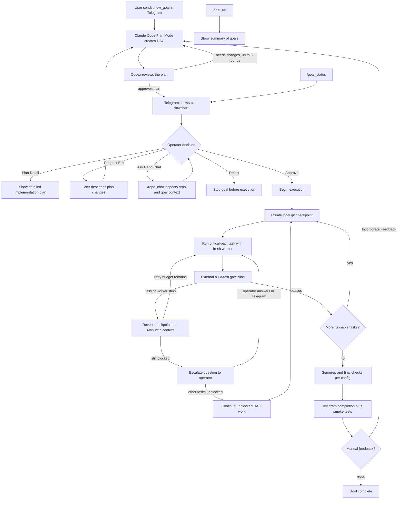

# SmithersBot

A Telegram-controlled multi-agent goal execution harness for local coding and research work.

SmithersBot is built around one operator chat: Telegram. You send `/new_goal <description>`, review the plan as a flowchart, ask for detail or edits, and approve execution from inline Telegram controls.

Under the hood, SmithersBot turns that operator-approved plan into a DAG of local Codex or Claude Code workers. It persists every plan, prompt, attempt, journal note, and run state file to disk; gates code changes with your own build and test commands; runs Semgrep at the configured cadence; and creates a local recoverability checkpoint before each task. The CLI exists as a supporting path for debugging, inspection, and automation, not as the intended day-to-day interface.

## Demo

Demo coming soon.

## Quick start

Start with Telegram. Send this to your configured SmithersBot chat:

`/new_goal <description>`

SmithersBot drafts the plan, runs the planner review loop, and sends the flowchart back to Telegram for approval. From there you can inspect the plan, request edits, ask repo-context questions, reject it, or approve it to run.

For debugging or automation, the CLI can start the same planning path and hold it for approval:

```bash
smithersbot goal "<task>" --plan-only
```

Goal state is persisted on disk. Set the state directory environment variable when you need to redirect that state for local testing or inspection.

## Telegram controls

- Plan messages carry inline buttons for **Approve**, **Plan Detail**, **Request changes**, and **Reject**.
- Reply to the plan to revise it.
- Reply to a blocked question to unblock the run.
- Reply to the done message to suggest follow-up work via **Incorporate Feedback**.
- Routing is scoped to the chat and topic thread the run was started in.

## Telegram commands

- `/new_goal <description>` starts a new goal.
- `/goal_status` shows the current state of the flowchart/DAG for a goal.
- `/goal_list` shows a summary of all goals.
- `/repo_chat <question>` asks repo and active-goal context questions.
- `/rc <question>` is the short alias for `/repo_chat`.
- `/chat_backend` configures repo chat to use Codex or Claude Code.
- `/nightwatch` configures the scheduled daily review.

## Repo chat

Repo chat is a Telegram-native planning tool, not a separate CLI chat product. Use `/repo_chat <question>` or the short alias `/rc <question>` to ask Codex or Claude Code about the repo, active goal context, and the plan currently waiting for approval. Replies to a prior repo-chat message continue the same session.

The backend is configurable with `/chat_backend`, which selects Codex or Claude Code for future repo-chat sessions.

A typical operator loop is to use repo chat before `/new_goal` to sharpen the initial prompt, then ask it after the flowchart is created: "I sent that prompt, does the plan look good to approve?" Repo chat can inspect the repo and current goal context, then recommend approving the plan or requesting an edit before any worker runs.

## How it works



Plans are validated structured objects: typed steps, explicit `dependsOn`, per-step worker backend, success criteria, constraints, and a project build/test gate. The CLI can render the same plan for debugging with `smithersbot goal detail <run_id>`.

## Worker backends

SmithersBot routes work to local Codex or Claude Code CLI workers. Whichever backend is installed on `PATH` is probed at startup and assigned work, using the operator's existing CLI login.

## What gets saved on disk

Every plan, worker prompt, stdout/stderr capture, attempt bundle, journal note, and run state file lives on disk under the goals state directory and can be inspected after the fact.

Each working directory can carry its own `CLAUDE.md`; SmithersBot also remembers per-directory and global lessons and injects the relevant ones into the worker prompt under a labelled section.

Completed runs can extract scoped lessons; later workers in the same working directory or globally automatically receive the relevant lessons in their prompt under a labelled section.

## Safety rails

- **Build/test gate.** Code-related steps cannot complete until the operator-configured build/test commands actually exit zero; SmithersBot runs the commands itself with `spawnSync` and captures full stdout/stderr.
- **Semgrep.** After each code-related step SmithersBot runs Semgrep against changed files (cadence configurable to `off`, `step`, or `goal`); a failed scan blocks the step the same way any other build-gate command failure does.
- **Hard-deny on tool calls.** Worker tool calls run through a typed deny check that blocks reads/writes to sensitive paths (env files, SSH keys, credentials) and a recursive command scanner that blocks dangerous shell forms, elevated-privilege commands, and publish/deploy/release commands.
- **Per-task git checkpoints.** Before each task starts, SmithersBot makes a local checkpoint commit on a per-run branch so a failed worker can be reverted to the pre-step state via a recoverability checkpoint reset. Checkpoint commits are local only; nothing is pushed.

## Execution flow

After approval, SmithersBot creates a local git checkpoint before each task, then runs the next critical-path task with a fresh worker. It runs the configured build/test gate itself, outside the worker, so the worker cannot bypass completion checks. Semgrep runs at the configured cadence, and the final Telegram message includes completion status plus manual tests and things to double-check.

## Recovery

If a worker's approach clearly fails, SmithersBot reverts to the pre-task checkpoint, records what happened, and retries with new context. It keeps running unblocked DAG tasks when possible, escalates to the operator in Telegram when it needs help, and reports clearly when the whole run is blocked.

If the gateway crashes mid-run, the next start reconciles stale in-progress steps; `smithersbot goal resume <run_id>` continues from the persisted run state on disk.

## Feedback loop

After completion, the operator can click **Incorporate Feedback** in Telegram with notes from manual testing. SmithersBot updates the plan and resumes execution until the goal completes again.

## Nightwatch

Nightwatch is a scheduled daily code review that runs in the background and delivers a summary plan to your configured Telegram chat; schedule and chat are configurable through `/nightwatch`.

## Status and limitations

SmithersBot is a personal, single-operator harness. A few things are worth knowing up front:

- Execution is sequential, not parallel.
- Recovery is bounded by a retry budget; it is not self-healing.
- Manual-test criticality is an LLM 1..10 heuristic, not a calibrated risk score.
- Read-only repo chat: Claude Code excludes the `Write` tool but allows `Bash`; Codex runs `--sandbox workspace-write` and relies on prompt compliance.
- Subscription-mode auth strips Anthropic credential env vars from the worker environment so the local CLI uses its own login; it is not a free or unlimited Claude.
- Crash recovery is best-effort and rolls the interrupted step back to `pending` to be replayed; it is not a formal guarantee.
- Per-directory memory: only `CLAUDE.md` is plumbed by the goal worker; `AGENTS.md` is read natively by Codex but not by the harness; `MEMORY.md` belongs to a different subsystem and is not read by the goal worker.

## Attribution

SmithersBot is a personal fork of OpenClaw. See `NOTICE.md` for attribution and license details.

## License

MIT. See `LICENSE`.
