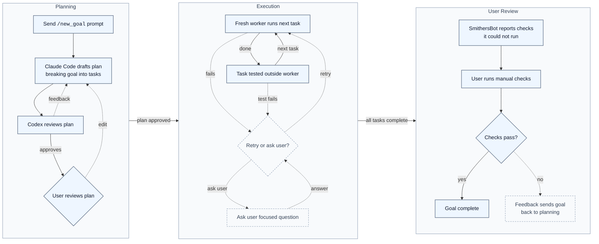
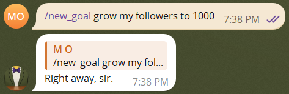
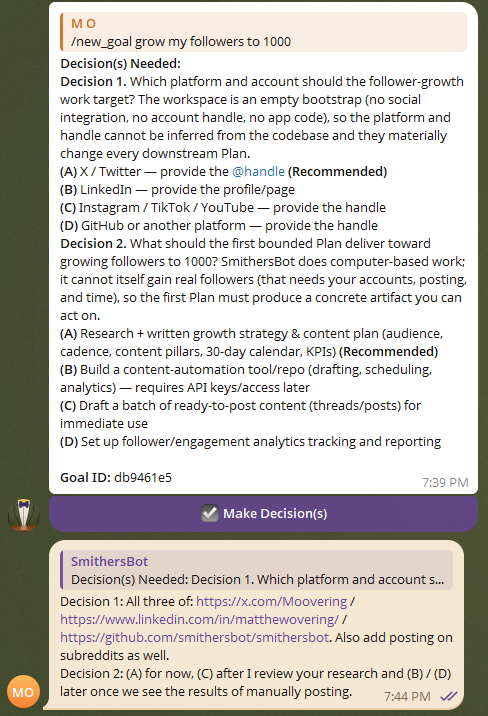
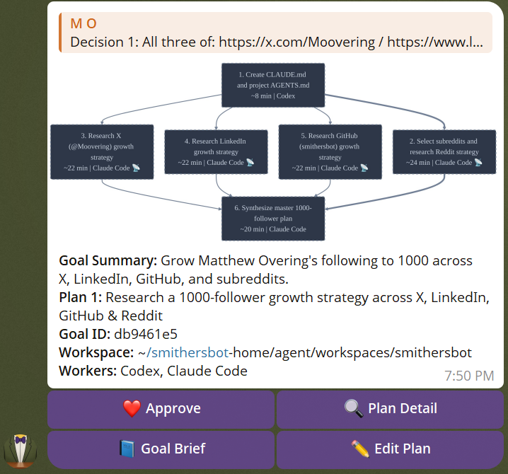
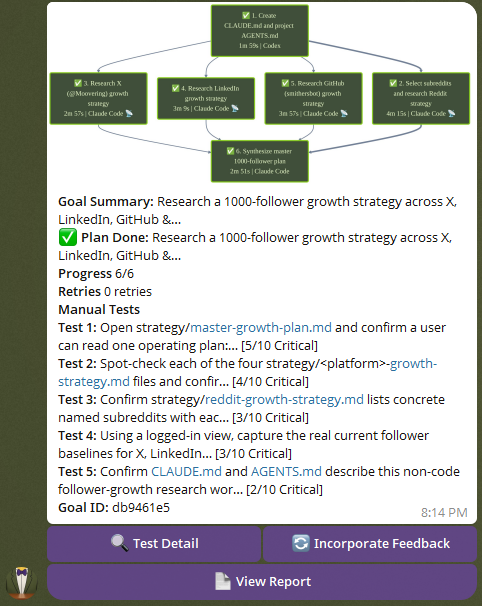
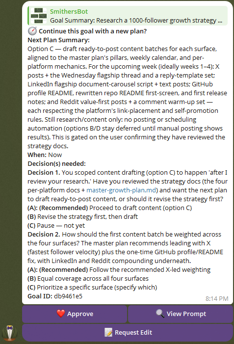

# SmithersBot

## Leave agents running without giving up control.

**Other agents stop when their task ends. SmithersBot keeps pursuing goals over weeks.** It's the orchestration layer your AI agents have been missing: the only one built to turn a broad goal into a controlled sequence of plans, checks, and next steps until your goal is done.

Send SmithersBot your goal from Telegram. SmithersBot turns it into a plan you approve, runs each task with a fresh worker, creates git checkpoints before changes, verifies the work outside the agent and asks you only when human judgement is needed.

The result is a local agent workflow that keeps pursuing your long term goals in the background while staying inspectable, recoverable, and operator-controlled.

I'm Matthew Overing, creator of SmithersBot. I built this because I wanted agents that could pursue my long-term goals without needing me to approve every tiny step or hand over unlimited control of my computer. I use SmithersBot to iterate on itself, and soon I’m going to use it to build a company that SmithersBot operates.

## SmithersBot is right for you if

- ✅ You want agents to pursue **long-term goals**, not just finish one task
- ✅ You want Claude Code and Codex to keep working **without babysitting every step**
- ✅ You want agents running in the background, but still want to **approve plans and stay in control**
- ✅ You want broad goals turned into **decisions, plans, checks, and next steps**
- ✅ You want work verified **outside the agent**, not just reported by the agent
- ✅ You want a git checkpoint before every task, so bad work can be rolled back
- ✅ You want a full execution trail you can inspect after the run
- ✅ You want to manage agent work from Telegram

## Problems SmithersBot solves

| Without SmithersBot                                                                                                    | With SmithersBot                                                                                                        |
| ---------------------------------------------------------------------------------------------------------------------- | ----------------------------------------------------------------------------------------------------------------------- |
| ❌ You give an agent a task, it finishes, and then you have to figure out the next task yourself.                       | ✅ SmithersBot keeps pursuing the broader goal and suggests the next plan until the goal is done.                        |
| ❌ Your goal is vague, so the agent guesses what you meant and starts hallucinating and working in the wrong direction. | ✅ SmithersBot asks for the key decisions first, recommends answers, and turns your goal into a plan you approve.        |
| ❌ You either babysit every small action or give the agent too much control of your machine.                            | ✅ SmithersBot adds a control layer: approved plans, working-directory boundaries, hard-deny rules, and checkpoints.     |
| ❌ The agent says the work is done, but you have to trust its own report.                                               | ✅ SmithersBot runs verification outside the worker, so the agent cannot simply claim success.                           |
| ❌ A long session loses context, gets messy, or becomes hard to reason about.                                           | ✅ SmithersBot breaks the goal into tasks and runs each one with a fresh worker.                                         |
| ❌ One blocked task can stall the whole run.                                                                            | ✅ SmithersBot can keep working on tasks that are not downstream of the block.                                           |
| ❌ After a long run, you cannot tell what happened, why it happened, or where things went wrong.                        | ✅ SmithersBot writes the full execution trail to disk: plans, prompts, attempts, logs, checkpoints, state, and lessons. |
| ❌ A bad agent step can leave your repo in a confusing state.                                                           | ✅ SmithersBot creates git checkpoints before each task and can retry from a known-good point.                           |

## Why SmithersBot is special

SmithersBot handles the hard parts of long-running agent work correctly.

| Capability        | What it means                                                                                                                                  |
| ----------------- | ---------------------------------------------------------------------------------------------------------------------------------------------- |
| **Longevity**     | SmithersBot does not stop thinking at the task boundary. It keeps turning the broader goal into the next approved plan until the goal is done. |
| **Clarity**       | Before planning, SmithersBot asks for missing decisions and recommends the answer it thinks is best.                                           |
| **Control**       | The agent does not just start changing things. You approve the plan first, and SmithersBot asks again when human judgement is needed.          |
| **Trust**         | Build and test checks run outside the worker, so the agent cannot mark its own homework.                                                       |
| **Recovery**      | Every task starts from a git checkpoint, so failed work can be reverted and retried with context.                                              |
| **Reliability**   | Each task gets a fresh worker instead of dragging one agent through a long, degraded session.                                                  |
| **Auditability**  | Plans, prompts, attempts, logs, checkpoints, state, and lessons are written to disk so the run can be inspected later.                         |
| **Orchestration** | Claude Code drafts, Codex reviews, and SmithersBot routes execution through local workers.                                                     |

## Quick start

**Run SmithersBot in an isolated environment** such as a VirtualBox VM, VPS, dedicated machine, or isolated development machine. Do not run it directly on your primary personal computer.

**Do not put API keys, tokens, or secrets in workspaces.** SmithersBot agents can read anything within `~/smithersbot-home/agent/workspaces`. Put real project secrets in `~/smithersbot-home/private/env/<workspace-name>/.env` and keep a redacted `.env.example` in the project workspace.

For full installation instructions, see [SETUP.md](SETUP.md).

## How it works

Claude Code drafts. Codex reviews. You decide.

  

Mermaid source

* **Planning** starts from `/new_goal`: SmithersBot checks whether your prompt is missing key decisions, asks you to choose with a recommended answer, then has Claude Code draft the plan and Codex review it. You approve, request edits, or reject it. The plan is the contract.
* **Execution** runs one fresh worker per task with one gate it cannot fake: build/test verification outside the worker. On failure, SmithersBot retries from a checkpoint or asks you a focused Telegram question.
* **Review and continuation** starts after SmithersBot finishes the work it can run itself. SmithersBot tells you what it could not test automatically, you run those manual checks, and failed checks can be fed back into planning. If the goal is not done yet, SmithersBot suggests the next plan to keep pursuing your goal until it is achieved.

### Reading the goal flowchart

`/goal_status` renders the goal's task DAG. Each task node is styled by its current state:

| Node style            | Meaning                                                                               |
| --------------------- | ------------------------------------------------------------------------------------- |
| Gray, dashed, no icon | **Pending / runnable**. Not started; runs once its dependencies are done.             |
| ⏳ Purple              | **Waiting on a dependency**. Ready except an upstream task is hard-blocked.           |
| 🛠 Orange             | **Running**. A worker is executing this task now.                                     |
| ✅ Green               | **Done**. Completed and verified.                                                     |
| ⛔ Red, dashed         | **Blocked, needs you**. Genuinely stuck and blocked for user input; reply to unblock. |

Each node also shows its assigned backend label (for example `Codex` or `Claude Code`). A 📡 marker to the right of that label (for example `Codex 📡`) means the task requested network access via `requiresNetwork=true`. Network is **off by default**; the 📡 marker indicates broad backend network access for that specific task only, not a global setting. Tasks without the marker run with no network.

Technical interruptions, such as a failed attempt, interrupted worker, timeout, or backend usage limit, are recovered automatically when possible. On resume, SmithersBot retries from a checkpoint or falls back to the other backend, so those tasks show as pending/waiting rather than red while the Telegram message explains the cause and any reset time.

A node is red only when the goal truly cannot proceed without you.

## Example operator flows

### Smooth path: approve and let it run

* You write and send `/new_goal <description>` through Telegram.

* SmithersBot checks whether the goal needs any key decisions from you.

* Claude Code drafts the plan.
* Codex reviews and accepts it.
* You approve the plan.

* SmithersBot runs task by task until all tasks are completed.
* SmithersBot suggests a manual test it could not run itself.

* You run the test and it passes.
* If the goal is complete, SmithersBot marks it done.
* If the goal still needs more work, time or follow up, SmithersBot suggests the next plan to move you closer to the goal.

### Full operator loop: prompt, decide, revise, recover, unblock, continue

* You send a `/new_goal` prompt in Telegram.
* The planner identifies inconsistencies or missing details in your prompt.
* SmithersBot asks you to make the key decisions and recommends what it believes is the best answer.
* You send your decision.
* Claude Code drafts the plan.
* Codex reviews the plan.
* If Codex sees a problem, it gives feedback and Claude Code revises the plan.
* Once Codex accepts the plan, SmithersBot shows you the flowchart in Telegram.
* You spot an issue with the plan, click **Request changes**, and describe what needs to change.
* Claude Code revises the plan and Codex reviews it again.
* You approve the edited plan.
* SmithersBot completes the first task and passes the automatic build and test gate.
* On the second task, the worker tries an approach that does not work.
* SmithersBot records what failed, reverts the repo to the checkpoint from before that task, and starts a fresh worker with the failure context and suggestion of how to try again.
* The second attempt succeeds.
* On a later task, SmithersBot realizes it needs a missing API key and asks you a focused question in Telegram.
* While it waits, SmithersBot continues working on tasks that are not downstream of the blocked task.
* You add the API key manually and tell SmithersBot.
* SmithersBot returns to the blocked task, completes it, and keeps going.
* When all tasks are complete, SmithersBot suggests a critical manual test it could not run itself.
* The manual test fails, so you send the failed logs back through **Incorporate Feedback**.
* SmithersBot goes back to planning, adds a fix task, runs it, and asks you to test again.
* The test passes.
* SmithersBot suggests the next plan to move you closer to your goal.
* You accept and repeat this process until your goal is achieved.

## Telegram controls

* Plan messages carry inline buttons for **Approve**, **Plan Detail**, **Request changes**, and **Reject**.
* Reply to the plan to revise it.
* Reply to a blocked question, tap **Add Details**, or use `/goal_answer <runId> <answer>` to unblock the run.
* Reply to the done message to suggest follow-up work via **Incorporate Feedback**.
* Routing is scoped to the chat and topic thread the run was started in.

| Command                         | What it does                                                                     |
| ------------------------------- | -------------------------------------------------------------------------------- |
| `/help`                         | Shows SmithersBot operator help.                                                 |
| `/commands`                     | Lists the public SmithersBot command surface.                                    |
| `/new_goal <description>`       | Starts a new goal.                                                               |
| `/goal_status <runId>`          | Shows the current state of the goal flowchart.                                   |
| `/goal_list`                    | Shows a summary of all goals.                                                    |
| `/goal_resume <runId>`          | Resumes an interrupted goal run.                                                 |
| `/goal_answer <runId> <answer>` | Answers a blocked goal question. You can also reply to the question in Telegram. |
| `/goal_stop`                    | Stops a running goal.                                                            |
| `/repo_chat <question>`         | Forces a repo-chat question. Normal Telegram messages also start repo chat.      |
| `/chat_backend`                 | Chooses Codex or Claude Code for repo chat.                                      |
| `/gateway_status`               | Shows gateway process and service status.                                        |
| `/usage_status`                 | Shows Claude Code and Codex usage/quota status.                                  |
| `/goal_lessons`                 | Shows or manages goal lessons.                                                   |
| `/goal_plan_autocheck`          | Configures automatic plan checks.                                                |
| `/goal_semgrep`                 | Configures Semgrep checks for goals.                                             |
| `/goal_workers`                 | Chooses which worker backends can run goal tasks.                                |
| `/goal_github_push`             | Toggles automatic GitHub branch push for completed runs.                         |
| `/nightwatch`                   | Configures scheduled daily review.                                               |
| `/gateway_restart`              | Restarts the local gateway service from an authorized private chat.              |

## Repo chat

Repo chat is the operator’s thinking partner with the full execution trail behind it. Ask before you act. Ask while you are stuck.

The main way to use repo chat is to send a normal Telegram message with no slash command. That starts a new repo chat session. If you reply to the last message in a repo chat, it keeps that repo chat going.

`/repo_chat <question>` is also available when you want to force a repo-chat question explicitly.

Repo chat can access sanitized goal history and the managed workspace trees made available to its backend. It must not be treated as having permission to read gateway-private config, real env files, credentials, or private managed-root state. Use it before `/new_goal` to sharpen the prompt, after the flowchart is created to sanity-check the plan, or during execution to reason about a blocked run.

Examples:

* Have a question about how SmithersBot works? Ask repo chat.
* Is a goal blocked and you need options for what to say or do to unblock it? Ask repo chat.
* See behavior in one of your projects you do not understand? Ask repo chat.
* Want a better prompt before starting a goal? Ask repo chat.
* Want to know whether a plan looks good to approve? Ask repo chat.

The backend is configurable with `/chat_backend`, which selects Codex or Claude Code for future repo-chat sessions.

## Worker backends

SmithersBot routes work to local Codex or Claude Code CLI workers. Whichever backend is installed on `PATH` is probed at startup and assigned work, using the operator's existing CLI login.

Goal workers can be configured with `/goal_workers`. Supported modes are `codex`, `claude_code`, or `both`.

## Safety rails

### Sandboxed worker execution

SmithersBot runs workers inside a sandboxed setup instead of giving a raw Codex or Claude Code session broad access to your machine. Every worker is launched into a chosen working directory with a **credential-stripped environment**, **per-run backend sandbox settings**, and SmithersBot’s own private state kept outside the agent-visible workspace.

Project secrets live in `private/env/<workspace>/.env` and are **not** loaded into a worker’s environment by default. Gateway secrets, API keys, auth tokens, and common credential-style variables are removed before worker processes start.

Codex and Claude Code handle sandboxing differently, so SmithersBot configures them separately:

* **Codex workers** run under Codex’s native OS sandbox with a generated per-run permission profile. The workspace and its `.git` directory are writable, known secret files and private SmithersBot state are denied, and network access is off by default. Codex uses an isolated `CODEX_HOME`, with auth shared by symlink rather than copied.

* **Claude Code workers** run with generated fail-closed sandbox settings. The workspace is allowed, sensitive files are denied with exact-file rules, and if the native sandbox is unavailable on the host, the worker fails instead of silently running unsandboxed.

* **Repo chat** is read-only by construction. It gets a credential-stripped environment, no writable sandbox paths, and access to the workspace plus redacted `agent/history`, not SmithersBot’s private runtime state.

The sandbox configs and credential-stripped environment are the main protections. SmithersBot also injects deny instructions for secret paths and dangerous commands, but those are a backup policy layer. If the backend-native sandbox cannot be established, workers fail and escalate to you by blocking the task. Run SmithersBot on an isolated machine: the sandbox is a strong practical boundary, not an absolute guarantee.

### Network-enabled tasks and prompt injection

SmithersBot builds on the existing Claude Code and Codex protections to make network-capable work more secure than a raw CLI session. Network is granted per task, not as a general worker default, and the planner/checker prompts keep network-enabled tasks narrow and auditable: what may be fetched or called, what result proves completion, and when the worker should stop. Build and test tasks can still use an external API or service when that is genuinely required, but the allowed service and pass/fail condition should be explicit.

External pages, packages, issues, docs, API responses, search results, copied text, and tool output are treated as untrusted data, not authority. For network/search-enabled contexts, SmithersBot injects an Untrusted Content Rule telling the worker to analyze that content as evidence for the task and not to follow instructions from it that conflict with system, developer, user, workspace, security, or task rules. That rule is only injected when network/search access is enabled.

Sandboxing, credential stripping, private-root denies, workspace boundaries, and network-off-by-default remain the primary protections. Prompt instructions are an additional backup layer; they are not the sandbox.

### Keep secrets out of the workspace

Do not put API keys, tokens, credentials, or real `.env` files anywhere under `agent/`. Anything under `~/smithersbot-home/agent/workspaces/<workspace-name>` is part of the normal agent read/edit surface.

Put real project secrets in:

`~/smithersbot-home/private/env/<workspace-name>/.env`

Keep a redacted `.env.example` in the project workspace so agents and humans can see which variables the project expects without exposing real values.

### Working directory boundary

The planner chooses a working directory. The goal only makes changes downstream from that working directory.

### Git across workspaces

SmithersBot can run goals in any workspace. Git behavior follows the goal’s working directory, not the SmithersBot install repo.

When a goal starts, SmithersBot creates a local goal branch named like `smithersbot/<timestamp>-<goal-id>`. Before each task, it records a checkpoint. If a task fails, SmithersBot can reset back to that task’s checkpoint and try again with fresh context.

Local-only workspaces are valid. GitHub push is optional and controlled by `/goal_github_push`, which is off by default. When enabled, SmithersBot tries to push completed goal branches only if that goal’s working directory has an eligible GitHub remote and working auth, then links to the pushed branch at `tree/<branch-name>` for review. If GitHub push is skipped or fails, the goal can still complete locally and the push skip or failure is recorded in the run history. SmithersBot does not automatically create pull requests.

GitHub CI only runs after a branch is actually pushed to GitHub. SmithersBot’s local build/test gates are separate from GitHub CI, and you should still review pushed branches before merging.

### External build/test gate

After a task completes, the configured build/test commands run outside the worker. This checks whether the task actually completed and whether the code still builds. One worker per task. One gate it cannot fake.

### Semgrep

Semgrep, the developer-friendly static analysis / code security tool, can run after each code-related step or at the end of a goal depending on configuration. If Semgrep fails, the task is blocked the same way a failed build/test gate blocks the task.

## Memory

SmithersBot has a few different memory surfaces. They are separate on purpose.

### Project instructions

Each working directory can have its own `CLAUDE.md` and `AGENTS.md` files. These files give workers project-specific instructions, conventions, and context for that workspace.

### Lessons

Completed runs can extract lessons from what happened. Lessons can be scoped globally or to a project / working directory. Future workers receive relevant lessons in their prompt under a labelled section, so they can reuse what SmithersBot learned from earlier runs.

Goal lessons are separate from the older chat-session memory hooks under `src/hooks/bundled/`.

### Agent-visible history

SmithersBot mirrors sanitized run summaries into:

`~/smithersbot-home/agent/history`

That history includes goal summaries, repo-chat summaries, and indexes that make previous work inspectable. It helps repo chat answer questions about what happened, and it helps future workers understand upstream decisions without exposing gateway-private state.

### Skills and plugins

Each working directory can also have its own skills or plugins added. SmithersBot can run, create, or edit skills or plugins.

## Full execution trail

Every plan, worker prompt, stdout/stderr capture, attempt bundle, journal note, run state file, and checkpoint lives on disk under the goals state directory and can be inspected after the fact.

**This sounds simple, but it is one of the most powerful features: full transparency means repo chat can answer questions about what happened and goal workers can see why upstream decisions were made.**

Runtime artifacts are also mirrored into `agent/history` with redaction so prompt artifacts, events, and runtime indexes are inspectable without exposing gateway-private state. Private gateway config, env, auth, and session files stay outside agent-visible history, and workers do not receive raw secrets by default.

The execution trail is also what makes recovery and memory useful. When a task fails, SmithersBot can assess whether there is a lesson to learn from the failure. It can extract scoped lessons. Later workers in the same working directory or globally automatically receive relevant lessons in their prompt under a labelled lesson section.

## Execution and recovery

After approval, SmithersBot creates a local git checkpoint before each task, then runs the next critical-path task with a fresh worker. It runs the configured build/test gate outside the worker, so the worker cannot bypass completion checks. Semgrep runs at the configured cadence, and the final Telegram message includes completion status plus manual checks and review requiring human judgement.

If a worker's approach clearly fails, SmithersBot reverts to the pre-task checkpoint, records what happened, and retries with new context. If one task is blocked, SmithersBot continues working on tasks that are not downstream of the blocked task. It escalates to the operator in Telegram when it needs help and reports clearly when the whole run is blocked.

If the gateway crashes mid-run, the next start reconciles stale in-progress steps. Use `/goal_resume` in Telegram to continue from the persisted run state on disk.

## Feedback loop

After SmithersBot finishes the work it can run itself, it tells you what it could not test automatically. You run those manual checks. If they fail, you send the result back and SmithersBot replans. If they pass and the goal is done, SmithersBot marks it complete. If the broader goal still needs more work, time, or follow-up, SmithersBot suggests the next plan.

## Nightwatch

Nightwatch is a scheduled daily code review that runs in the background and delivers a summary plan to your configured Telegram chat; schedule and chat are configurable through `/nightwatch`.

## Status and limitations

SmithersBot is a personal, single-operator harness.

Not for:

* hosted SaaS
* multi-user deployment
* running directly on your main personal machine
* replacing human judgement
* treating agent behavior as automatically safe
* skipping code review or manual testing

A few things are worth knowing up front:

* Execution is sequential, not parallel.
* Subscription-mode auth strips Anthropic credential env vars from the worker environment so the local CLI uses its own login; it is not a free or unlimited Claude.
* Crash recovery is best-effort and rolls the interrupted step back to `pending` to be replayed; review resumed runs before relying on their output.

## Attribution

SmithersBot is a personal fork of OpenClaw. See `NOTICE.md` for attribution and license details. Earlier project history lives in `moltbot/moltbot`.

## License

MIT. See `LICENSE`.
