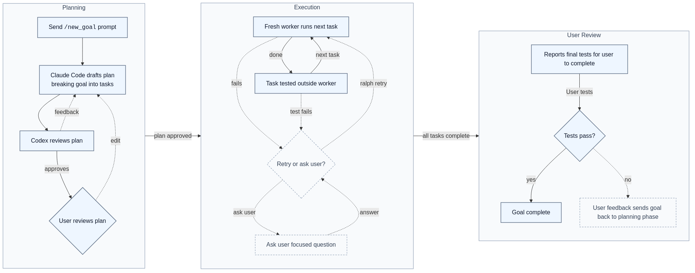
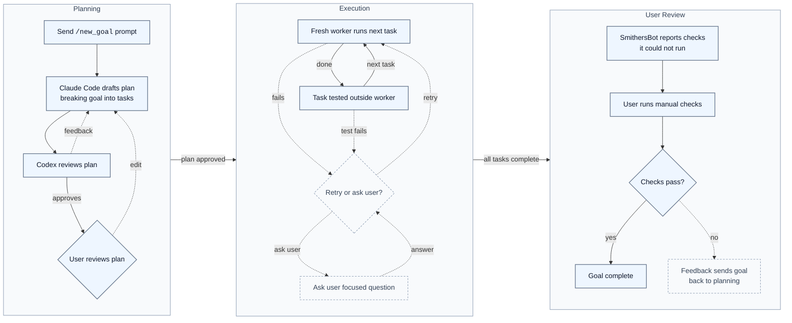

# SmithersBot

A Telegram-controlled multi-agent goal execution harness for local coding and research work.

<!-- TODO: refine one-liner using Marketing Made Simple. -->

SmithersBot is built around one operator chat: Telegram. You send `/new_goal <description>`, review the plan as a flowchart, ask for detail or edits, and approve execution from inline Telegram controls.

Under the hood, SmithersBot turns that operator-approved plan into a DAG of local Codex or Claude Code workers. It persists every plan, prompt, attempt, journal note, and run state file to disk; gates code changes with your own build and test commands; can run Semgrep, the developer-friendly static analysis / code security tool; and creates a local recoverability checkpoint before each task. The CLI exists as a supporting path for debugging, inspection, and automation, not as the intended day-to-day interface.

Candidate one-liners using a Problem -> Solution -> Result frame:

- Coding agents drift without oversight; SmithersBot runs them from Telegram with plans, checkpoints, and gates; you get useful automation without losing the operator seat.
- Local agent work is hard to trust; SmithersBot records every decision, prompt, and attempt; you can inspect what happened and recover when it goes wrong.
- Multi-step coding tasks stall on unclear handoffs; SmithersBot plans, delegates, verifies, and asks focused questions; projects keep moving with fewer context switches.
- Autonomous coding feels risky on a real machine; SmithersBot runs inside an isolated workspace with hard-deny rules and checkpoints; you get practical agency with practical boundaries.
- Agent runs are opaque after the fact; SmithersBot saves the full execution trail and lets repo chat inspect it; you can understand, debug, and improve every run.

Best current pick: "Coding agents drift without oversight; SmithersBot runs them from Telegram with plans, checkpoints, and gates; you get useful automation without losing the operator seat."

## Demo

Demo coming soon.

## Quick start

Start with Telegram. Send this to your configured SmithersBot chat:

`/new_goal <description>`

SmithersBot drafts the plan, runs the planner review loop, and sends the flowchart back to Telegram for approval. From there you can inspect the plan, request edits, ask repo-context questions, reject it, or approve it to run.

For debugging or automation, the CLI can start the same planning path and hold it for approval:

```bash
smithersbot goal "<task>" --plan-only
```

Goal state is persisted on disk. Set the state directory environment variable when you need to redirect that state for local testing or inspection.

## How it works

<p align="center">
  
</p>

<details><summary>Mermaid source</summary>



</details>

- **Planning** starts from `/new_goal`: Claude Code drafts the plan, Codex reviews it, and the user approves or requests edits.
- **Execution** runs one fresh worker per task and tests it outside the worker; on failure SmithersBot retries from a checkpoint or asks the user a focused Telegram question.
- **User Review** starts after SmithersBot finishes the work it can run itself. SmithersBot tells the user what it could not test automatically, the user runs those manual checks, passing checks complete the goal, and failed checks can be fed back into planning.

## Telegram controls

- Plan messages carry inline buttons for **Approve**, **Plan Detail**, **Request changes**, and **Reject**.
- Reply to the plan to revise it.
- Reply to a blocked question to unblock the run.
- Reply to the done message to suggest follow-up work via **Incorporate Feedback**.
- Routing is scoped to the chat and topic thread the run was started in.

Telegram commands:

- `/new_goal <description>` starts a new goal.
- `/goal_status` shows the current state of the flowchart/DAG for a goal.
- `/goal_list` shows a summary of all goals.
- `/repo_chat <question>` asks repo and active-goal context questions.
- `/chat_backend` configures repo chat to use Codex or Claude Code.
- `/nightwatch` configures the scheduled daily review.

## Repo chat

The main way to use repo chat is to send a normal Telegram message with no slash command. That starts a new repo chat session. If you reply to the last message in a repo chat, it keeps that repo chat going.

`/repo_chat <question>` is also available when you want to force a repo-chat question explicitly.

Repo chat is very powerful. It can access every action each agent has taken and can see every file available inside the environment where SmithersBot is running. Use it before `/new_goal` to sharpen the prompt, after the flowchart is created to sanity-check the plan, or during execution to reason about a blocked run.

Examples:

- Have a question about how SmithersBot works? Ask repo chat.
- Is a goal blocked and you need options for what to say or do to unblock it? Ask repo chat.
- See behavior in one of your projects you do not understand? Ask repo chat.
- Want a better prompt before starting a goal? Ask repo chat.

The backend is configurable with `/chat_backend`, which selects Codex or Claude Code for future repo-chat sessions.

## Worker backends

SmithersBot routes work to local Codex or Claude Code CLI workers. Whichever backend is installed on `PATH` is probed at startup and assigned work, using the operator's existing CLI login.

## Safety rails

### Run it isolated from your main computer

SmithersBot should not be run directly on your primary personal machine. The recommended setup is to run it in an isolated environment. I personally run it in a VirtualBox VM.

Other reasonable options include dedicated hardware, a VPS, Docker, or another isolated development machine. The point is to give the agent useful access to a working directory without giving it unnecessary access to your whole life. This does not make it risk-free, but it creates a practical safety boundary.

### Working directory boundary

The planner chooses a working directory. The goal only makes changes downstream from that working directory.

### Per-task git checkpoints

Before each task begins, SmithersBot creates a local checkpoint. If a worker gets into a bad state, SmithersBot can revert to the checkpoint and retry.

### External build/test gate

After a task completes, the configured build/test commands run outside the agent. This checks whether the task actually completed and whether the code still builds. The worker cannot simply claim success and bypass the verification step.

### Semgrep

Semgrep can run after each code-related step or at the end of a goal depending on configuration. If Semgrep fails, the task is blocked the same way a failed build/test gate blocks the task.

### Hard-deny checks

Worker tool calls run through a typed deny check that blocks sensitive path reads and writes, dangerous shell commands, and publish, deploy, or release commands.

## Memory

Each working directory has its own `CLAUDE.md` file created if it does not already have one. This gives workers project-specific instructions, conventions, and context.

SmithersBot also has a lessons system. Completed runs can extract lessons. Lessons can be scoped globally or to a project / working directory. Future workers receive relevant lessons in their prompt under a labelled section.

Each working directory can also have its own skills or plugins added. SmithersBot can be used to use, create, or edit skills or plugins.

## What gets saved on disk

Every plan, worker prompt, stdout/stderr capture, attempt bundle, journal note, and run state file lives on disk under the goals state directory and can be inspected after the fact.

**This sounds simple, but it is one of the most powerful features: full transparency means repo chat can answer questions about what happened and goal workers can see why upstream decisions were made.**

Each working directory has its own `CLAUDE.md`, skills, and plugins. SmithersBot remembers per-directory and global lessons and injects the relevant ones into the worker prompt under a labelled section.

When a task fails, SmithersBot can assess whether there is a lesson to learn from the failure. It can extract scoped lessons. Later workers in the same working directory or globally automatically receive relevant lessons in their prompt under a labelled lesson section.

## Execution and recovery

After approval, SmithersBot creates a local git checkpoint before each task, then runs the next critical-path task with a fresh worker. It runs the configured build/test gate outside the worker, so the worker cannot bypass completion checks. Semgrep runs at the configured cadence, and the final Telegram message includes completion status plus manual checks and review requiring human judgement.

If a worker's approach clearly fails, SmithersBot reverts to the pre-task checkpoint, records what happened, and retries with new context. If one task is blocked, SmithersBot continues working on tasks that are not downstream of the blocked task. It escalates to the operator in Telegram when it needs help and reports clearly when the whole run is blocked.

If the gateway crashes mid-run, the next start reconciles stale in-progress steps. Use `/goal_resume` in Telegram to continue from the persisted run state on disk.

## Feedback loop

After SmithersBot finishes the work it can run itself, it tells the user what it could not test automatically. The user runs those manual checks. If the checks pass, the goal is complete. If they fail, the user can tell SmithersBot what happened and it replans to fix the issue.

## Nightwatch

Nightwatch is a scheduled daily code review that runs in the background and delivers a summary plan to your configured Telegram chat; schedule and chat are configurable through `/nightwatch`.

## Status and limitations

SmithersBot is a personal, single-operator harness. A few things are worth knowing up front:

- Execution is sequential, not parallel.
- Read-only repo chat: Claude Code excludes the `Write` tool but allows shell commands; Codex runs in a workspace sandbox and relies on prompt compliance.
- Subscription-mode auth strips Anthropic credential env vars from the worker environment so the local CLI uses its own login; it is not a free or unlimited Claude.
- Crash recovery is best-effort and rolls the interrupted step back to `pending` to be replayed; it is not a formal guarantee.

## Attribution

SmithersBot is a personal fork of OpenClaw. See `NOTICE.md` for attribution and license details. Earlier project history lives in `moltbot/moltbot`.

## License

MIT. See `LICENSE`.
