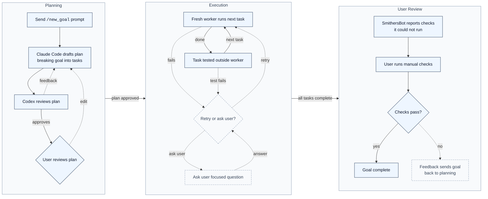

# SmithersBot

[](https://github.com/smithersbot/smithersbot/actions/workflows/ci.yml)

## Leave agents running without giving up control.

SmithersBot is for people who want Claude Code and Codex to keep working together for hours, but do not want to babysit every permission prompt or blindly trust an agent with their machine.

You send a goal from Telegram. SmithersBot turns it into a reviewed plan, runs each task with a fresh worker, git checkpoints before each step, verifies work outside the agent, and asks you only when human judgement is needed.

The result is a local agent workflow that keeps moving in the background while staying inspectable, recoverable, and operator-controlled.

## Why SmithersBot exists

Long agent runs fail in specific, repeatable ways. SmithersBot is built around those failure modes.

| Challenge                                                                                                                                                                                                                                                                                                                                                                      | Answer                                                                                                                                                                                                                                                            |
| ------------------------------------------------------------------------------------------------------------------------------------------------------------------------------------------------------------------------------------------------------------------------------------------------------------------------------------------------------------------------------ | ----------------------------------------------------------------------------------------------------------------------------------------------------------------------------------------------------------------------------------------------------------------- |
| **Context degradation**<br>Long Claude Code or Codex agent sessions need compaction. Compaction makes agents forget critical information, making them act unreliably. [Anthropic’s compaction docs](https://platform.claude.com/docs/en/build-with-claude/compaction) describe how long conversations are summarized and prior message blocks are dropped from later requests. | **Break the goal into tasks**. Each task gets a fresh worker that can inspect previous work when needed, instead of dragging one agent through a long cycle of information loss from expansion and compaction.                                                    |
| **Unattended work without blind trust**<br>Permission prompts force babysitting or unsafe permission skipping.                                                                                                                                                                                                                                                                 | **Add a configurable middle layer** with planning, approvals, working-directory boundaries, hard-deny rules, and git checkpoints.                                                                                                                                 |
| **Long runs become hard to understand**<br>After compaction, retries, and multiple sessions, it becomes hard to know what happened, why a decision was made, or where things went wrong.                                                                                                                                                                                       | **Write the execution trail to disk**: plans, prompts, attempts, stdout/stderr, journals, state, checkpoints, and lessons.                                                                                                                                        |
| **Linear plans stall too easily**<br>Claude Code and Codex can make plans, but the plans are one-dimensional. If one task gets blocked, everything stops and waits for the user.                                                                                                                                                                                               | **Plan as a DAG**, calculate the critical path, and keep working on tasks that are not downstream of the blocked task.                                                                                                                                            |
| **Agents are bad witnesses of their own work**<br>They often say tests passed when they did not, call failures "preexisting bugs" or avoid accountability when stuck.                                                                                                                                                                                                          | **Run verification tests outside the worker after each task**. The worker cannot simply claim success and bypass the build/test gate.                                                                                                                             |
| **Different models are good at different things**<br>Claude Code and Codex have different strengths. When I started this, Claude Code was generally accepted to be stronger at tool use and planning, while Codex was considered stronger at code creation and debugging.                                                                                                      | **Use them together**: Claude Code drafts plans, Codex reviews them, and local Codex or Claude Code workers are assigned to execute tasks where they fit best.                                                                                                    |
| **Sometimes the operator needs a thinking partner before acting**<br>The hard part of agentic execution is figuring out what to prompt, whether the plan is good, or what to do when something is blocked.                                                                                                                                                                     | **Repo chat gives you a Telegram-native way to ask questions**: with full repo and agent context. Use it to write a better `/new_goal` prompt, sanity-check a plan before approval, understand what happened during a run, or decide how to unblock a stuck task. |

## Demo

Demo coming soon. The demo asset is not included in this repository yet.

The planned demo will show the real operator loop: repo chat creating or refining a prompt, `/new_goal`, the plan flowchart, Plan Detail, Request changes, approval, task execution, completion, manual review, and Incorporate Feedback if needed.

## Quick start

**Strongly Recommended:** run SmithersBot in an isolated environment such as a VirtualBox VM, VPS, Docker container, dedicated machine, or isolated development machine, not directly on your primary personal computer.

Start with Telegram. Send this to your configured SmithersBot chat:

`/new_goal <description>`

SmithersBot drafts the plan, runs the planner review loop, and sends the flowchart back to Telegram for approval. From there you can inspect the plan, request edits, ask repo-context questions, reject it, or approve it to run.

For debugging or automation, the CLI can start the same planning path and hold it for approval:

```bash
smithersbot goal "<task>" --plan-only
```

Goal state is persisted on disk. Set the state directory environment variable when you need to redirect that state for local testing or inspection.

### Where files live (Stage 2S, transitional)

Stage 2S introduces a managed agent root that separates the agent-readable
workspace from a private area workers never see. New/default goal workspaces
resolve inside the managed agent root; existing installs at legacy paths still
work and are supported during this stage with a warning (opt into fail-closed
behavior with `config.goal.allowLegacyWorkingDir = false`).

```text
~/smithersbot-goals/                       # managed root (override: SMITHERSBOT_GOALS_ROOT)
  agent/
    workspaces/<workspace-name>/repo/      # goal worker cwd
    history/
      goals/<workspace>/<goalId>/          # sanitized goal-run summaries
      repo-chats/<workspace>/              # sanitized repo-chat sessions
      index/                               # global JSONL indexes for grep
  private/                                 # NOT agent-visible
    env/<workspace-name>/.env              # real env, host-side only
    config/  auth/  sessions/
  scratch/<runId>/<taskId>/                # gateway-controlled temp state

~/.smithersbot/                            # gateway-private state (unchanged)
  .env  smithersbot.json
  goals/  repo-chats/                      # canonical runtime stores
```

Portability rule for project code: read configuration through standard
environment variables — for example `process.env.GOOGLE_DRIVE_API_KEY` (Node) or
`os.environ["GOOGLE_DRIVE_API_KEY"]` (Python). The repo-root `.env.example` is
the portable variable-name contract with placeholder values only. Workers do
not receive raw secrets in env by default; real env files are loaded only by
trusted host-side commands with an explicit opt-in. Native backend sandboxing
is used only where SmithersBot implements and verifies it for the selected
backend; prompts and convention files are not security boundaries. Managed
workspaces organize which trees workers should use, but are not by themselves a
kernel boundary. Codex and Claude Code secret-read isolation is claimed only
after backend-specific live probes pass on the host. Codex `--sandbox
workspace-write` alone is not enough evidence of secret-read isolation, and
Claude sandboxing requires its native sandbox to start successfully.

## Fresh isolated setup

Use a fresh isolated machine for real operation: a VirtualBox VM, VPS, Docker container, dedicated machine, or isolated development machine. Do not run SmithersBot directly on your primary personal computer.

Prerequisites for either path:

- Node 22 or newer
- `git`
- Claude Code CLI and/or Codex CLI installed, on `PATH`, and logged in as the operator
- A Telegram bot token from BotFather
- Your Telegram user ID or operator chat ID for the allowlist

### Recommended setup script

Clone the repo, run the setup script, answer the prompts, then start the gateway:

```bash
git clone https://github.com/smithersbot/smithersbot.git
cd smithersbot
scripts/setup-smithersbot.sh
node scripts/run-node.mjs gateway
```

The script checks Node and git, prepares Corepack/pnpm, installs dependencies, builds the project, creates `~/.smithersbot`, writes `~/.smithersbot/.env`, writes `~/.smithersbot/smithersbot.json`, and restricts both files to mode `600`.

First Telegram smoke tests:

- `/help`
- `/commands`
- `/goal_list`
- `/repo_chat say only: repo chat works`
- `/new_goal Inspect the repository state and report whether the working tree is clean. Do not edit files.`

Stop the foreground gateway with `Ctrl-C`. Start it again with `node scripts/run-node.mjs gateway`, then send `/goal_list` or `/goal_resume <runId>` to confirm persisted goal state is still visible.

### Manual setup

If you do not want to use the setup script, clone, enable Corepack, install, and build:

```bash
git clone https://github.com/smithersbot/smithersbot.git
cd smithersbot
corepack enable
pnpm install --frozen-lockfile
pnpm build
```

Create local configuration with placeholder values replaced on the isolated machine:

```bash
mkdir -p ~/.smithersbot
cp .env.example ~/.smithersbot/.env
chmod 600 ~/.smithersbot/.env
```

Set `TELEGRAM_BOT_TOKEN` in the local env file. Then create `~/.smithersbot/smithersbot.json` with the Telegram channel enabled and restricted to your operator account:

```json
{
  "channels": {
    "telegram": {
      "enabled": true,
      "botToken": "${TELEGRAM_BOT_TOKEN}",
      "allowFrom": ["YOUR_TELEGRAM_USER_ID_OR_CHAT_ID"],
      "dmPolicy": "allowlist",
      "repoChatBackend": "codex"
    }
  }
}
```

```bash
chmod 600 ~/.smithersbot/smithersbot.json
```

If you want state somewhere other than the default, set `SMITHERSBOT_STATE_DIR` before starting SmithersBot. State, logs, goal artifacts, repo-chat transcripts, and gateway restart audit files live under the active state directory; goal run artifacts are under `goals/<run_id>/`.

Start the gateway from the repository root:

```bash
node scripts/run-node.mjs gateway
```

First Telegram smoke tests:

- `/help`
- `/commands`
- `/goal_list`
- `/repo_chat say only: repo chat works`
- `/new_goal Inspect the repository state and report whether the working tree is clean. Do not edit files.`

Stop the foreground gateway with `Ctrl-C`. Start it again with `node scripts/run-node.mjs gateway`, then send `/goal_list` or `/goal_resume <runId>` to confirm persisted goal state is still visible.

## How it works

Claude Code drafts. Codex reviews. You decide.

<p align="center">
  
</p>

<details><summary>Mermaid source</summary>



</details>

- **Planning** starts from `/new_goal`: Claude Code drafts the plan, Codex reviews it, and the user approves, requests edits, or rejects it. The plan is the contract.
- **Execution** runs one fresh worker per task with one gate it cannot fake: build/test verification outside the worker. On failure, SmithersBot retries from a checkpoint or asks the user a focused Telegram question.
- **User Review** starts after SmithersBot finishes the work it can run itself. SmithersBot tells the user what it could not test automatically, the user runs those manual checks, passing checks complete the goal, and failed checks can be fed back into planning.

### Reading the goal flowchart

`/goal_status` renders the goal's task DAG. Redundant arrows are removed (if `a → b → c`, the implied `a → c` is not drawn), so each arrow is a real dependency. Each task node is styled by its current state:

| Node style | Meaning |
| --- | --- |
| Gray, dashed, no icon | **Pending / runnable** — not started; runs once its dependencies are done. |
| ⏳ Purple | **Waiting on a dependency** — ready except an upstream task is hard-blocked. |
| 🛠 Orange | **Running** — a worker is executing this task now. |
| ✅ Green | **Done** — completed and verified. |
| ⛔ Red, dashed | **Blocked, needs you** — genuinely stuck (blocked for user input); reply to unblock. |

Technical interruptions — a failed attempt, an interrupted/lost worker (missing `worker_result.json`), a timeout, or a backend **usage limit** — are recovered automatically: on resume SmithersBot retries from a checkpoint or falls back to the other backend, so those tasks show as **pending/waiting** (not red) while the Telegram message explains the cause and any reset time. A node is red only when the goal truly cannot proceed without you. Skipped or cancelled tasks (e.g. after `/goal_stop`) leave active execution rather than getting a distinct node style.

## Example operator flows

### Smooth path: approve and let it run

- You write and send `/new_goal <description>` through Telegram.
- Claude Code drafts the plan.
- Codex reviews and accepts it.
- You approve the plan.
- SmithersBot runs task by task.
- SmithersBot suggests a manual test it could not run itself.
- You run the test and it passes.
- Your goal is achieved.

### Full operator loop: prompt, revise, recover, unblock, feedback

- You are not sure exactly how to phrase the goal, so you send a Telegram message to repo chat describing what you want.
- Repo chat inspects the repo and helps write a strong `/new_goal` prompt.
- You copy and paste that `/new_goal` prompt into Telegram.
- Claude Code drafts the plan.
- Codex reviews the plan.
- If Codex sees a problem, it gives feedback and Claude Code revises the plan.
- Once Codex accepts the plan, SmithersBot shows you the flowchart in Telegram.
- You spot an issue with the plan, click **Request changes**, and describe what needs to change.
- Claude Code revises the plan and Codex reviews it again.
- You approve the edited plan.
- SmithersBot completes the first task and passes the automatic build and test gate.
- On the second task, the worker tries an approach that does not work.
- SmithersBot records what failed, reverts the repo to the checkpoint from before that task, and starts a fresh worker with the failure context and suggestion of how to try again.
- The second attempt succeeds.
- On a later task, SmithersBot realizes it needs a missing API key and asks you a focused question in Telegram.
- While it waits, SmithersBot continues working on tasks that are not downstream of the blocked task.
- You add the API key manually and tell SmithersBot.
- SmithersBot returns to the blocked task, completes it, and keeps going.
- When all tasks are complete, SmithersBot suggests a critical manual test it could not run itself.
- The manual test fails, so you send the failed logs back through **Incorporate Feedback**.
- SmithersBot goes back to planning, adds a fix task, runs it, and asks you to test again.
- The test passes.
- Your goal is achieved.

## Telegram controls

- Plan messages carry inline buttons for **Approve**, **Plan Detail**, **Request changes**, and **Reject**.
- Reply to the plan to revise it.
- Reply to a blocked question to unblock the run.
- Reply to the done message to suggest follow-up work via **Incorporate Feedback**.
- Routing is scoped to the chat and topic thread the run was started in.

Telegram commands:

- `/help` shows SmithersBot operator help.
- `/commands` lists the public SmithersBot command surface.
- `/new_goal <description>` starts a new goal.
- `/goal_status` shows the current state of the flowchart/DAG for a goal.
- `/goal_list` shows a summary of all goals.
- `/goal_resume <runId>` resumes an interrupted goal run.
- `/goal_stop` stops a running goal.
- `/repo_chat <question>` asks repo and active-goal context questions.
- `/chat_backend` configures repo chat to use Codex or Claude Code.
- `/goal_lessons` shows or manages goal lessons.
- `/goal_plan_autocheck` toggles automatic plan checks.
- `/goal_semgrep` configures Semgrep checks for goals.
- `/goal_workers` configures goal worker concurrency.
- `/goal_github_push` toggles automatic GitHub push and PR creation for completed runs.
- `/nightwatch` configures the scheduled daily review.
- `/gateway_restart` restarts the local gateway service from an authorized private chat. During the service-name migration it supports both `smithersbot-gateway.service` and legacy `moltbot-gateway-dev.service`; explicit `SMITHERSBOT_SYSTEMD_UNIT`, then deprecated `MOLTBOT_SYSTEMD_UNIT`, then deprecated `CLAWDBOT_SYSTEMD_UNIT` wins over active-unit detection.

## Repo chat

Repo chat is the operator’s thinking partner with the full execution trail behind it. Ask before you act. Ask while you are stuck.

The main way to use repo chat is to send a normal Telegram message with no slash command. That starts a new repo chat session. If you reply to the last message in a repo chat, it keeps that repo chat going.

`/repo_chat <question>` is also available when you want to force a repo-chat question explicitly.

Repo chat can access sanitized goal history and the managed workspace trees made available to its backend. It must not be treated as having permission to read gateway-private config, real env files, credentials, or private managed-root state. Use it before `/new_goal` to sharpen the prompt, after the flowchart is created to sanity-check the plan, or during execution to reason about a blocked run.

Examples:

- Have a question about how SmithersBot works? Ask repo chat.
- Is a goal blocked and you need options for what to say or do to unblock it? Ask repo chat.
- See behavior in one of your projects you do not understand? Ask repo chat.
- Want a better prompt before starting a goal? Ask repo chat.
- Want to know whether a plan looks good to approve? Ask repo chat.

The backend is configurable with `/chat_backend`, which selects Codex or Claude Code for future repo-chat sessions.

## Worker backends

SmithersBot routes work to local Codex or Claude Code CLI workers. Whichever backend is installed on `PATH` is probed at startup and assigned work, using the operator's existing CLI login.

## Safety rails

### Run it isolated from your main computer

SmithersBot should not be run directly on your primary personal machine. The recommended setup is to run it in an isolated environment. I personally run it in a VirtualBox VM.

Other reasonable options include dedicated hardware, a VPS, Docker, or another isolated development machine. The point is simple: give the agent useful access to a working directory, not unnecessary access to your whole life. This does not make it risk-free, but it creates a practical safety boundary.

### Working directory boundary

The planner chooses a working directory. The goal only makes changes downstream from that working directory.

### Per-task git checkpoints

Before each task begins, SmithersBot creates a local checkpoint. If a worker gets into a bad state, SmithersBot can revert to the checkpoint and retry.

### External build/test gate

After a task completes, the configured build/test commands run outside the agent. This checks whether the task actually completed and whether the code still builds. One worker per task. One gate it cannot fake.

### Semgrep

Semgrep, the developer-friendly static analysis / code security tool, can run after each code-related step or at the end of a goal depending on configuration. If Semgrep fails, the task is blocked the same way a failed build/test gate blocks the task.

### Hard-deny checks

Worker tool calls run through a typed deny check that blocks sensitive path reads and writes, dangerous shell commands, and publish, deploy, or release commands.

## Memory

Each working directory has its own `CLAUDE.md` file created if it does not already have one. This gives workers project-specific instructions, conventions, and context.

SmithersBot also has a lessons system. Completed runs can extract lessons. Lessons can be scoped globally or to a project / working directory. Future workers receive relevant lessons in their prompt under a labelled section.

Goal lessons are separate from the older chat-session memory hooks under `src/hooks/bundled/`.

Each working directory can also have its own skills or plugins added. SmithersBot can be used to use, create, or edit skills or plugins.

## Full execution trail

Every plan, worker prompt, stdout/stderr capture, attempt bundle, journal note, run state file, and checkpoint lives on disk under the goals state directory and can be inspected after the fact.

**This sounds simple, but it is one of the most powerful features: full transparency means repo chat can answer questions about what happened and goal workers can see why upstream decisions were made.**

The execution trail is also what makes recovery and memory useful. When a task fails, SmithersBot can assess whether there is a lesson to learn from the failure. It can extract scoped lessons. Later workers in the same working directory or globally automatically receive relevant lessons in their prompt under a labelled lesson section.

## Execution and recovery

After approval, SmithersBot creates a local git checkpoint before each task, then runs the next critical-path task with a fresh worker. It runs the configured build/test gate outside the worker, so the worker cannot bypass completion checks. Semgrep runs at the configured cadence, and the final Telegram message includes completion status plus manual checks and review requiring human judgement.

If a worker's approach clearly fails, SmithersBot reverts to the pre-task checkpoint, records what happened, and retries with new context. If one task is blocked, SmithersBot continues working on tasks that are not downstream of the blocked task. It escalates to the operator in Telegram when it needs help and reports clearly when the whole run is blocked.

If the gateway crashes mid-run, the next start reconciles stale in-progress steps. Use `/goal_resume` in Telegram to continue from the persisted run state on disk.

## Feedback loop

After SmithersBot finishes the work it can run itself, it tells the user what it could not test automatically. The user runs those manual checks. If the checks pass, the goal is complete. If they fail, the user can tell SmithersBot what happened and it replans to fix the issue.

## Nightwatch

Nightwatch is a scheduled daily code review that runs in the background and delivers a summary plan to your configured Telegram chat; schedule and chat are configurable through `/nightwatch`.

## Status and limitations

SmithersBot is a personal, single-operator harness.

Not for:

- hosted SaaS
- multi-user deployment
- running directly on your main personal machine
- replacing human judgement
- treating agent behavior as automatically safe
- skipping code review or manual testing

A few things are worth knowing up front:

- Execution is sequential, not parallel.
- Subscription-mode auth strips Anthropic credential env vars from the worker environment so the local CLI uses its own login; it is not a free or unlimited Claude.
- Crash recovery is best-effort and rolls the interrupted step back to `pending` to be replayed; review resumed runs before relying on their output.

## Attribution

SmithersBot is a personal fork of OpenClaw. See `NOTICE.md` for attribution and license details. Earlier project history lives in `moltbot/moltbot`.

## License

MIT. See `LICENSE`.
