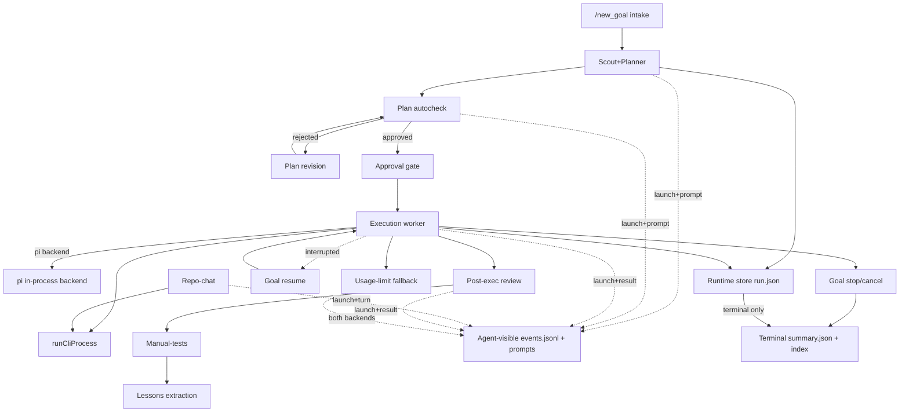

# Stage 2U-C — End-to-End Agent Flow Map

**Task:** `agent-flow-map` (read-only documentation)
**Date:** 2026-05-23
**Goal:** Stage 2U-C agent flow, history durability, sandbox, prompt, and token audit
**HEAD context:** branch `claw/run/20260523-163427Z-8cec60ca…` (preflight decision GO — see `STAGE2U_C_PREFLIGHT.md`)

This document is the canonical map of how SmithersBot's agent system executes a goal end-to-end:
which component calls which, which backends each phase may use, which files/dirs it reads and
writes, which history artifacts are **agent-visible** vs **runtime-store-only**, **when** those
artifacts are written relative to the backend spawn, where prompts are constructed, where token
usage is captured, and what happens on crash / restart / resume / usage-limit fallback.

It reflects the **post-instrumentation** state of the tree (the Stage 2U-C primitives in
`src/goal/agent-history-events.ts` are already wired into every agent task surface). All
line numbers are approximate anchors; treat function names as the stable reference.

---

## 0. Trust zones and the agent-visible vs runtime-store distinction

`src/config/managed-paths.ts` defines a managed root (`~/smithersbot-goals` by default, override
`SMITHERSBOT_GOALS_ROOT`) split into three trust zones:

| Zone | Resolver | Agent-visible? | Contents |
| --- | --- | --- | --- |
| `<root>/agent/` | `resolveAgentRoot` | **YES** (sanitized) | workspaces/repo, sanitized history, indexes |
| `<root>/private/` | `resolvePrivateRoot` | **NO** (host-only) | real env, config, auth, sessions |
| `<root>/scratch/` | `resolveScratchRoot` | gateway-controlled | temporary run/task scratch |

**Agent-visible history layout** (this is the durability target of Stage 2U-C):

- Goal history dir — `resolveAgentGoalHistoryDir(workspace, goalId)` →
  `<root>/agent/history/goals/<workspace>/<goalId>/`
  - `events.jsonl` — **incremental** JSONL appended via `appendAgentHistoryEvent` (one line per event, `fs.appendFileSync`, secrets stripped by `redactJsonValue`).
  - `prompts/<ts>-<phase>-<backend>-<uuid>.txt` — exact prompt after `redactSecretValues`, atomic tmp+rename via `writeAgentPromptArtifact`.
  - `summary.json` — **terminal-only** snapshot via `mirrorGoalRunToAgentHistory` (see §6).
- Repo-chat history dir — `resolveAgentRepoChatHistoryDir(workspace)/<sessionId>/`
  - `events.jsonl` + `prompts/` (incremental, same primitives, scope kind `repo-chat`).
  - `summary.json` — **terminal-only** via `mirrorRepoChatSessionToAgentHistory` (see §6).
- Index dir — `resolveAgentHistoryIndexDir()` → `<root>/agent/history/index/`
  - `all-goals.jsonl`, `repo-chats.jsonl` — terminal-only one-per-id append (`appendJsonlOnce`).

**Runtime store (canonical, NOT agent-visible):** `~/.smithersbot/goals/<runId>/`
(`run.json`, `scout/`, `autocheck/round-*/`, `workers/<stepId>/…`, `sessions/`), the global lessons
store `<stateDir>/goal-lessons.json`, and repo-chat sessions `~/.moltbot/repo-chats/<id>/session.json`.
Workers cannot read this zone (hard-denied); they only see the sanitized `<root>/agent/history` mirror.

**Worker scratch result (in the agent workspace, ephemeral):**
`<workingDir>/.moltbot-goal-worker-results/<runId>/<stepId>/attempt-<N>/worker_result.json`.

### Stage 2U-C instrumentation primitives (`src/goal/agent-history-events.ts`)

| Primitive | Behavior | When called |
| --- | --- | --- |
| `writeCriticalAgentLaunchEvent` | Fail-closed: writes redacted prompt artifact + `event:"launch"` JSONL line; **throws** on write failure | **BEFORE** every backend spawn |
| `writeAgentPromptArtifact` | Atomic tmp+rename of exact prompt after `redactSecretValues` | inside the launch writer |
| `appendAgentHistoryEvent` | Atomic single-line JSONL append, recursively redacted | incremental, during/after |
| `appendAgentHistoryEventBestEffort` | Returns `{ok:false, warning}` instead of throwing | **AFTER** backend return (result/failure/fallback) |
| `parseBackendUsage` | Normalizes Claude stream-json `usage` and Codex `token_count`/`usage` into one record; `{available:false, reason}` when not derivable | after backend output |

---

## 1. End-to-End Agent Flow

The phases below run in roughly this order for a goal; repo-chat and nightwatch are independent.

### 1.1 `/new_goal` intake
- **Caller → callee:** Telegram `/new_goal` → `src/telegram/goal-commands.ts` (`runGoalInBackground`) → `src/commands/goal.ts goalCommand()` → creates `GoalSession`, resolves workspace via `resolveWorkspaceRepoDir`, persists initial `SerializedRun` (`saveRun`), then calls `runCliPlanning`.
- **Backends:** none directly (intake is orchestration only).
- **Reads:** config, workspace conventions (`.claude/CLAUDE.md`), prior `run.json` on resume.
- **Writes (runtime):** `~/.smithersbot/goals/<runId>/run.json` (`saveRun`, atomic JSON).
- **Agent-visible:** none until a downstream phase emits events (and `summary.json` at terminal state).
- **Prompt construction / token capture:** none.

### 1.2 Scout + Planner (combined) — `runCliPlanning`
- **Caller → callee:** `goalCommand()` → `src/goal/cli-planner.ts runCliPlanning()` → `buildPlanningPrompt()` (`renderScoutTemplate` + plan/scout appendix) → `writeCriticalAgentLaunchEvent` → `runCliProcess()` → `validateScoutOutput()` + `parsePlanWithFallback()`.
- **Backends:** Claude Code preferred, **Codex fallback** (`resolvePlannerBackends`). Claude args `-p --allowedTools Read,Glob,Grep,Bash`; Codex `buildCodexPlanningArgs` (`exec`, sandbox workspace-write/read-only).
- **Reads:** scout template, repo (read-only tools), prior scout artifacts. **Writes (runtime):** `<runDir>/scout/PLANNING_BRIEF.md`, planner stdout/stderr, `execution_plan.json`.
- **Agent-visible history:** `goals/<ws>/<goalId>/events.jsonl` + `prompts/…planner….txt`.
- **When written:** prompt artifact + `launch` event **BEFORE** spawn (`writeCriticalAgentLaunchEvent`, ~cli-planner.ts:928); best-effort `failure`/`retry`/`fallback`/`result` events **after** spawn (`appendPlannerHistoryBestEffort`).
- **Prompt site:** `buildPlanningPrompt()` (cli-planner.ts). **Token capture:** `parseBackendUsage(stdout+stderr)` after spawn; also threaded into the planner attempt bundle.

### 1.3 Plan autocheck / checker / review — `runPlanAutocheck`
- **Caller → callee:** `goalCommand()` / `goalResumeCommand()` → `src/goal/plan-autocheck.ts runPlanAutocheck()` → per-round `runReviewerAttempt()` (resume) / `runFreshReviewerAttempt()` → `writeCriticalAgentLaunchEvent` → `runCliProcess()` → `parseDecisionFromText()`.
- **Backends:** Codex or Claude Code (`params.mode`), with two-backend fallback; reviewer **session is resumable** (`--resume`/`resume <id>`), backend-bound.
- **Reads:** plan + prior feedback. **Writes (runtime):** `<runDir>/autocheck/round-*/` (`prompt.txt`, `response.txt`, `session_id.txt`, `backend.txt`, `metadata.json`).
- **Agent-visible:** `events.jsonl` (`launch`/`result`/`round`) + redacted `prompts/…autocheck….txt`.
- **When written:** `launch` event + prompt artifact **BEFORE** each round's spawn (~plan-autocheck.ts:614); `result` (approved/rejected) **after** (`appendAutocheckHistoryBestEffort`).
- **Prompt site:** `buildAutocheckPrompt()` (embeds `REVIEW_INSTRUCTION`). **Token capture:** `parseBackendUsage` per round.

### 1.4 Approval / replanning — `runCliPlanRevision`
- **Caller → callee:** `runPlanAutocheck()` (on rejection, rounds < max) → `src/goal/cli-planner.ts runCliPlanRevision()` → `buildPlanRevisionPrompt()` → `writeCriticalAgentLaunchEvent` → `runCliProcess()`; revision committed via `params.commitRevision()` callback.
- **Backends:** same as planner (Claude preferred, Codex fallback).
- **Writes (runtime):** `<runDir>/revision*/` stdout/stderr; updated plan. **Agent-visible:** `launch`/`result`/`failure` events (`phase:"plan-revision"`) + redacted prompt artifact, launch **BEFORE** spawn (~cli-planner.ts:644).
- **Approval gate:** approved plans flow to execution; otherwise blocked/needs-clarification surfaces to user (`/goal_answer`).

### 1.5 Execution worker — `agent-executor → cli-runner → cli-worker → cli-process`
- **Caller → callee:** `executeGoalWithAgent()` (`src/goal/agent-executor.ts`) attempt loop → `runner.execute(context)` → `CliTaskRunner.execute()` (`src/goal/cli-runner.ts`) → `executeTaskWithCliWorker()` (`src/goal/cli-worker.ts`) → `runCliProcess()` (`src/goal/cli-process.ts`). The `pi` backend routes through `PiRunner` instead (in-process; §5).
- **Backends:** per-step backend (clamped to enabled workers) with availability probe (`backend-availability.ts isBackendAvailable`) and usage-limit fallback (`agent-executor-helpers.ts pickFallbackBackend`); both Codex and Claude Code go through the **shared native sandbox helper** (`backend-sandbox.ts`).
- **Reads:** repo (sandboxed). **Writes (runtime):** `<runDir>/workers/<stepId>/` (`worker_result.json`, `attempt-<N>.json` bundles incl. `tokenUsage`, `attempt-N.stdout/stderr.txt`, `worker-prompt-N.txt`, `capability-bounds.txt`, `auth-mode.txt`). **Writes (workspace scratch):** `.moltbot-goal-worker-results/.../worker_result.json` (the worker's own result file).
- **Agent-visible history:** `goals/<ws>/<goalId>/events.jsonl` (`launch` → `result`/`failure`) + redacted prompt artifact.
- **When written:** `writeCriticalAgentLaunchEvent` (`phase:"worker"`, sanitized argv, prompt path) **BEFORE** `runCliProcess` (~cli-worker.ts:447, spawn ~500); `appendWorkerHistoryBestEffort` with outcome/error-class/tokenUsage **after** return, including the `.catch()` process-error path **before** control returns to the executor.
- **Prompt site:** `buildCliWorkerPrompt()` / `buildCliPromptPayload()`. **Token capture:** `parseBackendUsage(stdout+stderr)` → `AttemptBundle.tokenUsage` + result event.
- **Missing result:** if `worker_result.json` absent → `process_lost` (no exit code/signal) or `missing_result` (process exited); invalid JSON/schema triggers `repairResultFile()` (separate 60 s `runCliProcess`); outcomes classified by `classifyAttemptOutcome` (`process_lost`/`crash`/`timeout`/`rate_limit`/`failed`). The failure event is recorded **before** any user-facing message.

### 1.6 Repair / retry paths
- **Result-file repair:** `repairResultFile()` (cli-worker.ts) re-spawns the backend for 60 s to fix malformed JSON/schema before the attempt is classified failed.
- **Attempt retry:** `agent-executor.ts` loop, `maxAttempts` default 2; `shouldRetry()` retries `timeout`/`crash`/`rate_limit` outcomes; attempt number = `attemptBundles.length + 1`.
- **Build-gate fix cycles:** up to `DEFAULT_MAX_BUILD_GATE_FIX_CYCLES` (2) synthetic retries when the build gate fails.
- **Ralph retry:** on `status:"ralph"`, reset to base SHA and retry up to `maxRalphAttempts` (2).
- All retries reuse the same agent-visible event stream (new `launch` per attempt, then `result`/`failure`).

### 1.7 Repo-chat — `runRepoChatWorker`
- **Caller → callee:** Telegram repo-chat command → `src/repo-chat/repo-chat-worker.ts runRepoChatWorker()` → `runWithBackendFallback` → `runRepoChatWorkerOnce()` → `writeCriticalAgentLaunchEvent` → `runCliProcess()` (~line 622).
- **Backends:** Claude Code + Codex; fallback clears `cliSessionId` (session is backend-bound). Resume linkage via `cliSessionId` (`--resume`/`exec resume`) and Codex `codexSandboxRunId`.
- **Reads:** none persistent (state via `cliSessionId`). **Writes (runtime):** `~/.moltbot/repo-chats/<id>/session.json` (`saveRepoChatSession`).
- **Agent-visible history:** `repo-chats/<ws>/<sessionId>/events.jsonl` (`launch` → `turn_start` → `success`/`failure`) + redacted prompt artifact; `summary.json` at terminal save only.
- **When written:** `launch` + prompt **BEFORE** spawn (~line 581), `turn_start` before spawn, `success`/`failure` after return — all **before** the error propagates. **Prompt site:** `buildClaudeRepoChatArgs`/`buildCodexRepoChatArgs` (system = `CLAUDE_READ_ONLY_PROMPT + REPO_CHAT_CONTEXT`). **Token capture:** `parseBackendUsage`.

### 1.8 Post-execution review — `runPostExecutionReview`
- **Caller → callee:** post-execution orchestration → `src/goal/post-execution-review.ts runPostExecutionReview()` → `runWithBackendFallback` → `runReviewForBackend()` → `runSingleReviewPass()` (per diff chunk) → `writeCriticalAgentLaunchEvent` → `runCliProcess()` (~line 406).
- **Backends:** Claude Code preferred, Codex fallback on usage/rate-limit (`detectUsageLimitKind`).
- **Reads:** bounded diff (`buildBoundedDiffOrChunks`). **Writes:** none persistent (read-only review).
- **Agent-visible:** `launch` event + redacted prompt **BEFORE** each chunk spawn (~line 363); `result`/`failure` after. **Prompt site:** `buildPostExecutionReviewPrompt()`. **Token capture:** `parseBackendUsage`. Single-shot (no session resume).

### 1.9 Manual-tests generation — `generateManualTests`
- **Caller → callee:** post-execution → `src/goal/manual-tests.ts generateManualTests()`. **Two paths:** (A) `GoalLlmClient.complete()` (`src/goal/llm-client.ts`, Anthropic SDK via pi-ai; usage in `res.usage`); (B) CLI fallback `generateManualTestsViaCli` → `runManualTestsForBackend` → `runCliProcess` (~line 329).
- **Backends:** GoalLlmClient if provided; else Claude Code + Codex fallback.
- **Writes (runtime):** `<runDir>/manual-tests/stdout.txt`/`stderr.txt` (redacted). **Agent-visible:** `launch` + redacted prompt **BEFORE** the call (client ~682, CLI ~303); `result`/`failure` after. **Token capture:** `usageFromGoalLlmClient` (client path — note: GoalLlmClient returns usage but does **not** itself persist it; the instrumentation now records it) or `parseBackendUsage` (CLI path). **Prompt site:** `buildCombinedManualTestsPrompt`/`buildManualTestsUserPrompt`.

### 1.10 Lessons extraction — `extractRunLessons`
- **Caller → callee:** post-execution → `src/goal/lessons.ts extractRunLessons()` → `runWithBackendFallback` (`fallbackOnAnyError=true`) → `runClaudeLessonExtraction` (`runCliProcess` ~420) / `runCodexLessonExtraction` (`runCliProcess` ~522).
- **Backends:** Claude Code + Codex; fail-open (returns `[]` if both fail).
- **Reads:** `loadRun(runId)`, attempt bundles, existing lessons. **Writes (runtime):** lessons store `<stateDir>/goal-lessons.json` (`saveLessons`, atomic).
- **Agent-visible:** `launch` + redacted prompt **BEFORE** spawn (~402/502); `result`/`failure`/`fallback` after; lessons themselves remain in the durable lessons store, not agent history. **Prompt site:** `buildLessonExtractionPrompt` (+`buildCorrectionSummary`). **Token capture:** `parseBackendUsage`.

### 1.11 Goal resume — `goalResumeCommand`
- **Caller → callee:** `/goal_approve` / `/goal_resume` → `src/commands/goal-resume.ts goalResumeCommand()` → `loadRun(runId)` (triggers `migrateRun`) → `recheckUsageLimitBackends()` → `executeGoalWithAgent()`.
- **Resume reads prior state:** `SerializedRun` from `run.json`, plus the **agent-visible `events.jsonl`** remains on disk from prior phases (durable), so a future scout/planner/repo-chat worker can read what already happened even after a gateway restart.
- `requiresExecutionAnswer()` distinguishes auto-retry keys (`git`/`resume_execution`/`none`) from blocks needing explicit `/goal_answer`.

### 1.12 Goal stop / cancel
- **Caller → callee:** `/goal_stop` (or cancellation) → run state transitioned to `cancelled` via `saveRun` → `mirrorGoalRunToAgentHistory` fires (terminal mirror writes `summary.json` + index entry, see §6). Cancellation is a race boundary: persisted state is reloaded before applying planner/executor outputs and terminal cancellation is not transitioned out of.

### 1.13 Usage-limit fallback
- **Worker (execution):** `agent-executor.ts` loop detects usage/rate-limit (`isUsageLimitClassReason`, `parseClaudeCodeStreamError`, `classifyProviderError`), calls `pickFallbackBackend` (Claude↔Codex swap), and writes an **agent-visible event for BOTH** the failed backend and the selected fallback backend incrementally (`appendWorkerFallbackHistoryEvent`, `event:"usage_limit"` / `"usage_limit_fallback"`) before retrying. On final exhaustion the step is `blocked` with reason `usage_limit`.
- **Planner / autocheck / review / lessons / manual-tests:** each detects `anthropic_usage_limit` / `anthropic_overloaded` / `anthropic_rate_limit` (`detectAnthropicDegradedReason` / `detectUsageLimitKind`), records degraded reason, and falls back Claude→Codex, emitting incremental `fallback` events.
- **Repo-chat:** fallback to the other backend, clearing `cliSessionId`, with both attempts recorded.
- **Transient overload** (planner) auto-retries with bounded backoff (5 s, 10 s) before falling back.

### 1.14 Backend selection — Codex vs Claude Code

| Surface | Default / preference | Fallback | Sandbox path (see security audit) |
| --- | --- | --- | --- |
| Scout+Planner | Claude Code | Codex | credential-stripped, native-sandbox opt-out |
| Plan autocheck | `params.mode` (Codex or Claude) | other | credential-stripped opt-out |
| Plan revision | Claude Code | Codex | credential-stripped opt-out |
| Execution worker | per-step / `DEFAULT_BACKEND=claude_code` (or single enabled), plus `pi` | Claude↔Codex (usage-limit) | **shared native sandbox helper** |
| Repo-chat | caller `params.backend` | other (clears session) | **shared native sandbox helper** |
| Post-exec review | Claude Code | Codex | credential-stripped opt-out |
| Manual-tests | GoalLlmClient, else Claude Code | Codex | client / credential-stripped opt-out |
| Lessons | Claude Code | Codex | credential-stripped opt-out |

Availability is probed once per execution via `detectBackendAvailability` (`codex exec --help`, `claude --help`); `clampBackendForEnabledWorkers` forces the single backend when only one worker is enabled.

---

## 2. Prompt-construction sites (where the prompt string is built)

| Phase | Prompt builder | Persisted to agent history? |
| --- | --- | --- |
| Scout+Planner | `buildPlanningPrompt` (cli-planner.ts) | YES, redacted, before spawn |
| Plan revision | `buildPlanRevisionPrompt` (cli-planner.ts) | YES |
| Autocheck | `buildAutocheckPrompt` (plan-autocheck.ts) | YES |
| Worker | `buildCliWorkerPrompt` / `buildCliPromptPayload` (cli-worker.ts) | YES |
| Repo-chat | `buildClaudeRepoChatArgs` / `buildCodexRepoChatArgs` (repo-chat-worker.ts) | YES |
| Post-exec review | `buildPostExecutionReviewPrompt` (src/prompts/post-execution-review) | YES |
| Manual-tests | `buildCombinedManualTestsPrompt` / `buildManualTestsUserPrompt` | YES |
| Lessons | `buildLessonExtractionPrompt` (+`buildCorrectionSummary`) | YES |

All prompt artifacts pass through `redactSecretValues` before being written to `<…>/prompts/`.

## 3. Token-capture sites

`parseBackendUsage` (normalizes Claude stream-json `usage` + Codex `token_count`/`usage`) is called
after backend output in: cli-planner (planner + revision), plan-autocheck, cli-worker, repo-chat-worker,
post-execution-review, manual-tests (CLI path), lessons. The manual-tests **client** path uses
`usageFromGoalLlmClient` over `GoalLlmClient.complete().usage`. Captured usage is recorded into the
agent-visible `result` event and (for the worker) `AttemptBundle.tokenUsage`. Where exact tokens are
not derivable the record is `{available:false, reason}` (never fabricated). The `pi` in-process backend
exposes usage via pi-ai but is not currently normalized into the same record (gap — see §8).

---

## 4. ALL `runCliProcess` callers (scope classification)

`runCliProcess` is defined in `src/goal/cli-process.ts`. Every caller:

| # | File | Surface | In scope? | Reason |
| --- | --- | --- | --- | --- |
| 1 | `src/goal/cli-worker.ts` | Execution worker | **IN** | Core agent task surface; instrumented + sandboxed. |
| 2 | `src/goal/cli-planner.ts` | Scout+Planner & plan-revision | **IN** | Agent planning surface; instrumented. |
| 3 | `src/goal/plan-autocheck.ts` | Plan autocheck/checker | **IN** | Agent review surface; instrumented. |
| 4 | `src/goal/post-execution-review.ts` | Post-execution review | **IN** | Agent review surface; instrumented. |
| 5 | `src/goal/manual-tests.ts` | Manual-tests (CLI fallback) | **IN** | Agent generation surface; instrumented. |
| 6 | `src/goal/lessons.ts` | Lessons extraction | **IN** | Agent extraction surface; instrumented. |
| 7 | `src/repo-chat/repo-chat-worker.ts` | Repo-chat | **IN** | Agent chat surface; instrumented + session-keyed history. |
| 8 | `src/telegram/goal-sending.ts` | **Codex Mermaid-diagram repair** | **OUT** | Utility that repairs malformed Mermaid syntax for the Telegram DAG PNG (`buildCodexMermaidRepairArgs`, `MERMAID_REPAIR_TIMEOUT_MS=60s`). Not an agent task surface — no goal/step semantics, no plan output, output is a diagram string. Excluded from instrumentation/token audit. |
| 9 | `src/cron/nightwatch.ts` | **Cron lesson-condense maintenance** | **OUT** | Daily maintenance job that condenses global lessons (`LESSON_CONDENSE_TIMEOUT_MS=120s`). Not an interactive agent surface. Uses `--skip-git-repo-check` — a benign Codex flag for running outside a git repo, **NOT** a sandbox bypass. Excluded. |

**`src/goal/pi-runner.ts` — special case (NOT a `runCliProcess` caller):** the `pi` backend executes
**in-process** via `@mariozechner/pi-ai` (`getModel`, `backend:"pi"`, runtime API key), so it never spawns
a CLI subprocess and never reaches `runCliProcess`. It **is** an agent worker EXECUTOR backend (fallback
option in `cli-runner`/`agent-executor`), so it is **in scope as a backend** — but its security boundary is
capability-enforcement / hard-deny (`capability-enforcement.ts`, `hard-deny.ts`), **not** the OS native
sandbox used for Codex/Claude. Its token usage is available from pi-ai but not yet normalized into the
agent-history token record (gap — §8).

---

## 5. Backend execution boundaries (summary; full classification in the security audit)

- **Worker & repo-chat** route Codex and Claude Code through the **shared native sandbox helper**
  (`backend-sandbox.ts`: `writeCodexNativeSandboxConfig` permission profile / `buildClaudeCodeSandboxLaunchConfig`
  fail-closed settings). Repair/resume reuse the same helper.
- **Scout/planner, autocheck, post-exec review, manual-tests, lessons** are **credential-stripped**
  (`buildCredentialStrippedEnv` / `buildClaudeCodeEnv`, `stripClaudeSubscriptionAuthEnv`) but **opt out** of
  the proven file-read deny matrix (Codex coarse `--sandbox read-only`/`workspace-write`; Claude no native
  sandbox). These are flagged as 2U-E hardening targets.
- **`pi`** = in-process capability-enforcement boundary, not OS sandbox.

See `STAGE2U_C_AGENT_SURFACE_SECURITY_TOKEN_PROMPT_AUDIT.md` and `agent-surface-audit.ts` for the full table.

---

## 6. Crash / restart / resume behavior

### Terminal-only mirrors (important)
`mirrorGoalRunToAgentHistory` (`src/goal/agent-history.ts:95`) writes the agent-visible `summary.json`
+ `all-goals.jsonl` index entry **only at terminal states** — it is gated in `saveRun`
(`run-store.ts:50-52`) by `run.state === "done" | "blocked" | "cancelled"`.
`mirrorRepoChatSessionToAgentHistory` (`agent-history.ts:147`) writes the repo-chat `summary.json` +
index entry **only** inside `saveRepoChatSession` (`repo-chat-store.ts:174`).

**Consequence:** the *summary/index* artifacts are NOT incremental. Durability of in-flight state now
comes from the Stage 2U-C `events.jsonl` + `prompts/` written by `writeCriticalAgentLaunchEvent` /
`appendAgentHistoryEvent*` **before and during** each phase. So if the gateway dies after a phase
starts, the `launch` event + prompt artifact are already on disk even though no `summary.json` exists yet.

### Restart reconciliation
- `loadRun()` calls `migrateRun()` (`run-store.ts:~72`): migrates legacy field/status formats and performs
  **stale-execution recovery** — if `state === "executing"` and there is no active run lock, the run is
  marked `done` (all steps done) or `blocked` ("Run was interrupted…").
- `hasActiveRunLock()` (`run-store.ts:~188`) checks `<goals>/.locks/runs/<runId>.lock` PID liveness and
  deletes stale locks.
- `reconcileStaleRuns()` (`run-store.ts:~229`) scans `~/.smithersbot/goals/` on startup and reloads stale
  executing runs (each `loadRun` triggers migration).

### Resume
- `goalResumeCommand` reloads `SerializedRun` and prior agent-visible history; `recheckUsageLimitBackends`
  re-targets usage-limited steps to an available backend before re-executing.
- Repo-chat follow-up rediscovers the prior session via the persisted session store + `cliSessionId`
  resume linkage and the session-keyed agent-visible history dir.

---

## 7. Flow diagram

Out-of-scope `runCliProcess` callers (not agent task surfaces): `goal-sending` (Mermaid repair),
`nightwatch` (cron lesson-condense). `pi-runner` is an in-process backend, not a `runCliProcess` caller.

---

## 8. Known gaps / forward pointers (for the consolidated 2U-C audit)

- **Summary/index mirrors are terminal-only** by design; in-flight durability relies entirely on the
  incremental `events.jsonl`/`prompts/` primitives. (Behavior, not a bug — documented above.)
- **`pi` backend token usage** is available from pi-ai but not yet normalized into `parseBackendUsage`'s
  agent-history token record.
- **Credential-stripped, native-sandbox-opt-out** surfaces (planner/autocheck/review/manual-tests/lessons)
  are candidates for 2U-E sandbox hardening.
- Static-vs-dynamic prompt ordering for cache efficiency is a 2U-E concern (out of scope here).

These feed the consolidated report `STAGE2U_C_AGENT_SURFACE_SECURITY_TOKEN_PROMPT_AUDIT.md`
(security/prompt/token tables) and the machine-readable `STAGE2U_C_AGENT_FLOW_MAP.json`.
